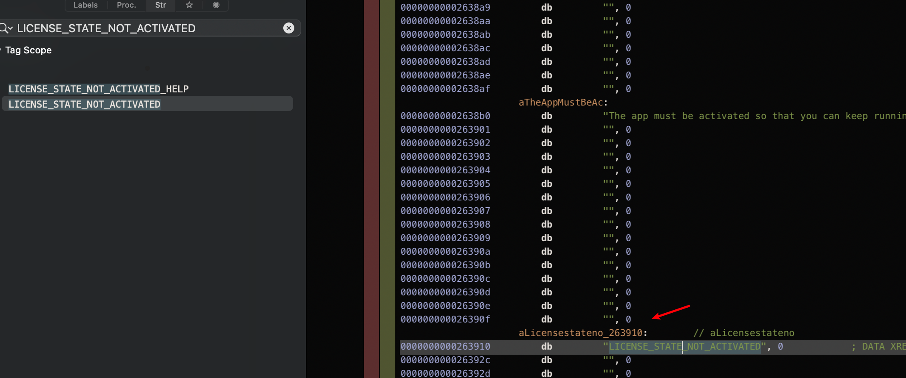

# MAC OS 逆向以及代码注入

## 1. 环境准备
-  ida | hopper
- python3 & frida  
  pip3 uninstall frida  
  pip3 uninstall frida-tools  
  pip3 install frida  -i http://mirrors.aliyun.com/pypi/simple/ --trusted-host mirrors.aliyun.com  
  pip3 install frida-tools -i http://mirrors.aliyun.com/pypi/simple/ --trusted-host mirrors.aliyun.com
- dylib 注入工具
	https://github.com/tyilo/insert_dylib
- rd_route 劫持库
	https://github.com/rodionovd/rd_route


## 2. 用 IDA 或者 hopper 软件 逆向分析

第一步 寻找特征


利用 苹果软件的  i18n 来搜索关键字符串
用 IDE 打开这个目录


全局搜索  Your copy of AirBuddy is not activate

注意看，这些文件是一个 framework 和一个 xpc 文件中存在的。xpc 就不多说了，就没有意义。我们直接重点关注 AirCore.framework 文件。

```
/Applications/AirBuddy.app/Contents/Library/LoginItems/AirBuddyHelper.app/Contents/Frameworks/AirCore.framework/Versions/A/Resources/en.lproj/Localizable.strings
/Applications/AirBuddy.app/Contents/Library/LoginItems/AirBuddyHelper.app/Contents/Frameworks/AirCore.framework/Versions/A/AirCore
```


"LICENSE_STATE_NOT_ACTIVATED" = "Your copy of AirBuddy is not activated.";

可以看到字符串引用key就是 “LICENSE_STATE_NOT_ACTIVATED”。
我们直接在 IDA|HOPPER 中打开 AirCore 搜索：




找到定位后 查找 引用该字符串的代码 


继续 查看 函数 6b4c0 的引用

事情此时变得有趣了起来：这个一看就很不对劲的函数 [ _$sSS7AirCoreE27locLicenseStateNotActivatedSSvau ]没有任何调用方！
下面那个函数也是如此，那么他是如何被调用的呢？


由于这不是在主进程中，所以我们大胆假设：这是一个导出函数！


我们到 Exports 里面复制一部分的文字搜索，果然。
那么问题来了，哪里引用了呢？

我们直接搜主程序试试：
（主程序: /Applications/AirBuddy.app/Contents/MacOS/AirBuddy）


果然不出所料。
我们继续跟进去,一直跟进看看他是如何被调用的：


然后查看流程图 , 可以看到 函数头为 sub_100050480


在这个函数的入口中，a1 所在的 r13 寄存器对内存 +153 的偏移处进行判断 (hopper 显示的 十六 进制  +0x99)，
如果不等于 1 那么执行这里的 A1F78 函数（104行），否则执行刚刚找到的 NotActivated。

```
__stubs:00000001000A1F78 jmp cs:_$sSS7AirCoreE24locLicenseStateActivatedSSvau_ptr
```


打开流程图, 可以看到, 如果执行 104 行的话, 最后会执行 sub_100017DF0 来返回函数返回值.

## 3. 用 frida 调试 hook

python 文件新建，写入 (hook_main.py)

然后我们要准备一个 _index.js，否则就没戏唱了。
那么有玩 frida 比较多的朋友可能会问，为什么不用 frida -f xxx 启动这个 app 进程 还要 python 这么麻烦？
解答：
    frida 在 macOS 上的 inlinehook 有问题，会造成 app 挂起无法恢复运行状态导致超时，系统强制终止进程。因为系统认为 app 卡死了。启动失败嘛。

下面我们看下 ts 文件 ( index.ts , Utils.ts)

然后编译ts到js文件的指令：

```
build : frida-compile index.ts -o _index.js
watch : frida-compile index.ts -o _index.js -w
```
build 是编译，-w是监视文件修改自动编译。
我们执行 watch 的指令即可自动编译了。

准备工作完成，那么我们开始hook函数 __int64 __usercall sub_100050480@<rax>(__int64 a1@<r13>) 看看:  
我们把可执行文件的名称写在 参数1 中，这样就会自动锁定内存里这个同名进程进行注入。

获取函数偏移: 
moduleBaseAddr = 0x0000000100000000  
funOffset = funAddr - moduleBaseAddr = 0x0000000100050480 - 0x0000000100000000 = 0x50480


然后我们获取这个指针所在的地址，开始进入函数的挂钩：
```javascript

hook(getPointer(0x50480), (ths, rev) => {

}, (ths, args) => {

    let r13 = ths.context["r13"];
    let tp = new NativePointer(r13).add(153);
    log("current:", tp.readInt())
    tp.writeInt(0)
    log("after:",tp,tp.readInt())
})
```


之后 运行我们的 python 脚本, 自动启动 AirBuddy 后 

r13  + 153 指向的地址成功被修改, 并且注册成功了


## 4. 用 dylib 代码注入 hook

注入我用的是 rd_route 劫持库.


毕竟不能靠 Frida 先启动然后再启动 app，这并不酷，也不符合我对高科技的想象。

用 AppCode 或者 XCode 新建项目:


如图所示。
然后 import 一下几个基本库：
UI 控件库是注入 CleanMyMac 的，可以不写。


```
#import <objc/runtime.h>
#import <mach-o/dyld.h>
#import <SwiftUI/SwiftUI.h>
#import "rd_route.h"

```


直接写内联汇编啊铁子！（突然激动
s

```c
void AirBuddy(){
    intptr_t _0x100050480 = _dyld_get_image_vmaddr_slide(0) + 0x100050480;
    rd_route((void *) _0x100050480, _0x100050480New, (void **) &_0x100050480Ori);
}
+ (void) load {
    NSString *appName = [[NSBundle mainBundle] bundleIdentifier];
    const char *myAppBundleName = [appName UTF8String];
    NSLog(@"=== AppName is %s.",myAppBundleName);
    AirBuddy();
}
```
然后我们用 _dyld_get_image_vmaddr_slide(0) + 0x100050480; 加上函数偏移得到内存中这个函数的偏移地址。
为什么 _dyld_get_image_vmaddr_slide 参数选 0 捏？因为这是选择第一个镜像（也就是可执行文件本身的内存空间镜像基址），具体细节懒得说，百度搜一下大家就懂了。
记住写 0 就是表示 App 可执行文件本身,也就是你注入的那个进程本身。别乱写哦，因为app在运行时不止一个内存镜像。
然后我们伪造一个函数 0x100050480New 进行挂钩。
```c
int _0x100050480New() {
    NSLog(@"==== _0x100050480New called");
    __asm
    {   
        //内联汇编直接修改寄存器的值
        mov byte ptr[r13+99h], 0
    }
    NSLog(@"==== _0x100050480New call end");
    return _0x100050480Ori(); // 调用原函数恢复执行
}
```
接下来声明一下原始函数保存地址，这里直接转换成函数结构体可以直接调用
```c
int (*_0x100050480Ori)();
```
定义原函数返回值int 无参数 加上 取该变量内存地址里的值以被下面挂钩函数赋新值： 
rd_route((void *) _0x100050480, _0x100050480New, (void ) &_0x100050480Ori);  
(void ) &_0x100050480Ori 这里用 (void *) 进行类型转换，&取地址符传递地址进函数。 
然后 _0x100050480Ori 保存的就是原函数地址了，注意如果不写“ * ”你会得到 _0x100050480Ori 的内存地址而不是这个内存地址里面的值。   
然后使用经典的 mov 指令在函数进入时将寄存器的值赋予 0，并恢复原函数执行，这样原函数读到的就是新的 r13 寄存器里的这个 0 值啦！
```asm
__asm
    {   
        //内联汇编直接修改寄存器的值
        mov byte ptr[r13+99h], 0
    }

```

按下 build 狠狠的编译出dylib文件。libairbuddy.dylib


要 hook 的 函数是主程序 AirBuddy.app 的啊,
为啥 用 insert_dylib 注入 lib 的时候 , 注入的 LetsMove.app 啊??


因为我们想修改内存的是主程序二进制文件，所以我们千万不要注入任何影响到偏移地址有关的文件，如 AirCore 和 AirBuddy 二进制文件，为什么呢？因为这样会造成文件偏移错误。我们的偏移地址是根据IDA读出的原始二进制来算的，如果你注入了这些文件地址就会发生移位，这就无法通过原地址进行正确的注入了。所以我挑了个好欺负的小文件。也别去注入几MB的大文件，手动来回复制文件很麻烦的。

注意: 生成的 libInlineInjectPlugin 文件位置确定后,不要删除,否则注入的程序启动会失败
```shell

Usage: insert_dylib dylib_path binary_path [new_binary_path]
Option flags: --inplace --weak --overwrite --strip-codesig --no-strip-codesig --all-yes

dylib="/Users/voidm/Downloads/insert_dylib"
target_dll="/Users/voidm/Library/Developer/Xcode/DerivedData/InlineInjectPlugin-gkfcehaqmflzmaewkaqxbqdjwhdv/Build/Products/Debug/libInlineInjectPlugin.dylib"
target_bin="/Applications/AirBuddy.app/Contents/Frameworks/LetsMove.framework/Versions/A/LetsMove"
out_bin="/Applications/AirBuddy.app/Contents/Frameworks/LetsMove.framework/Versions/A/LetsMove"

backup_name="${target_bin}_$(date +%Y%m%d%H%M%S)"
cp "$target_bin" "$backup_name"

sudo $dylib $target_dll $target_bin $out_bin
```


## 5. Ref
- 2024, macOS-InjectPluginCode, https://github.com/QiuChenlyOpenSource/macOS-InjectPluginCode
- 2024, [MacOS逆向] AirBuddy2 2.6.3 的dylib注入方案 (2) , https://www.52pojie.cn/thread-1739112-1-1.html
- 2023, Search Engine By Google.
- 2023, Bing Global Search Engine By Microsoft.
- 2023, MacOS动态注入的三种方式及hook方案, https://blog.csdn.net/tangsilian/article/details/89442802
- 2023, macOS 逆向從入門到破解 Frida + Hopper + dylib 注入, https://beeeeemo.dev/2021/08/macos-%E9%80%86%E5%90%91%E5%BE%9E%E5%85%A5%E9%96%80%E5%88%B0%E7%A0%B4%E8%A7%A3-frida-hopper-dylib-%E6%B3%A8%E5%85%A5/
- 2023, 404 WebSite by code-examples.net, https://code-examples.net/zh-CN/q/204273
- 2023, JianShu by https://www.jianshu.com/p/3c8a9a6cee8d
- 2023, 404 WebSite by https://github.com/rodionovd/rd_route
- 2023, 使用Frida优雅调试010 Editor https://www.chinapyg.com/thread-134972-1-1.html
- 2023，Objective-C的hook方案（一）: Method Swizzling by https://blog.csdn.net/yiyaaixuexi/article/details/9374411
- 2023，运行时注入方式破解最新Mac版010 Editor v9.0.1  https://www.52pojie.cn/forum.php?mod=viewthread&tid=861809&extra=page%3D1%26filter%3Dtypeid%26typeid%3D377 
